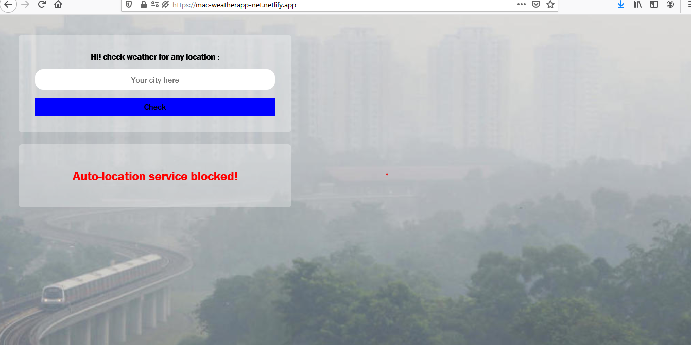
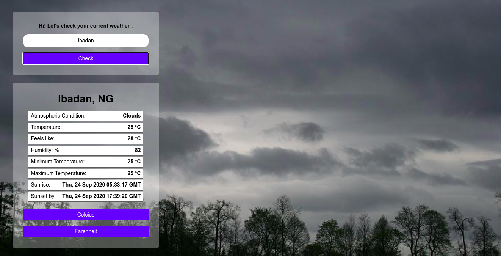
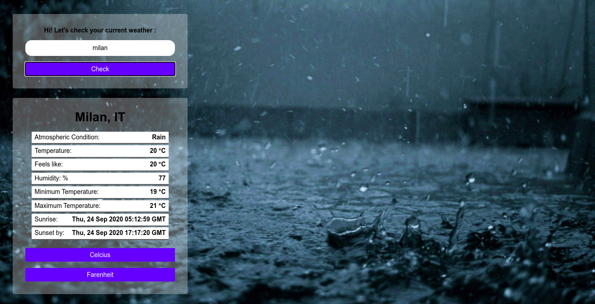
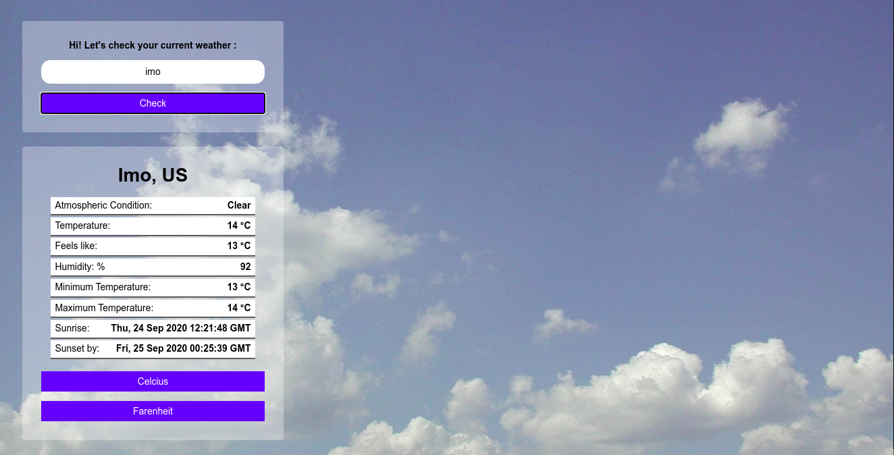

# Weather Forecast App

> This is a Weather Forecast App built with JavaScript 

## Live Demo

<a href="https://mac-weatherapp-net.netlify.app/" target="_blank">Weather Forecast App</a>

 Homepage

Cloudy Weather Page

Rainy Weather Page

Clear Weather Page

## Built With

- HTML
- SASS
- JavaScript (ES6)
- Open Weather API
- Netlify

## Acknowledgments

- [The Odin Project (Project Spec)](https://www.theodinproject.com/courses/javascript/lessons/weather-app)

